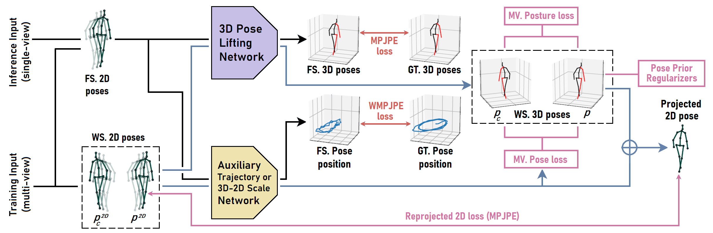
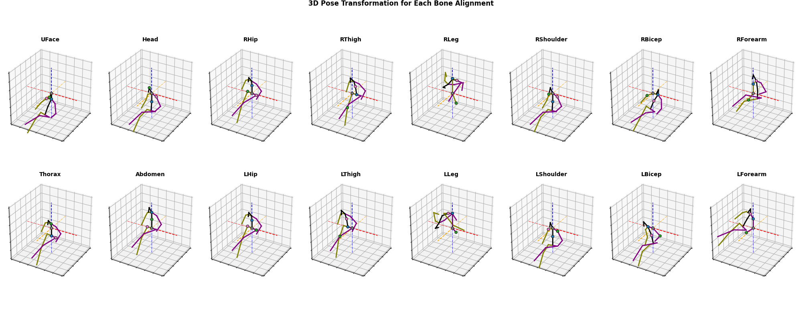
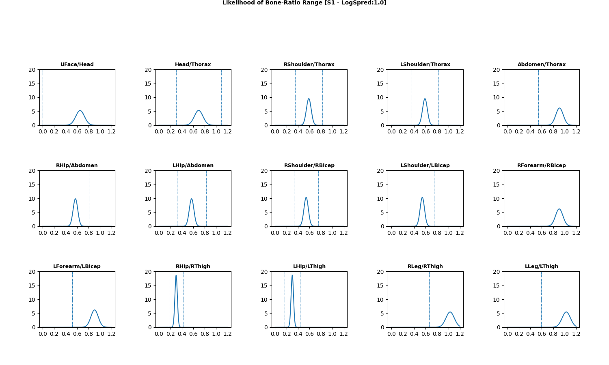

# Improving 3D human pose estimators with weakly supervised losses and biomechanical pose regularizers
[//]: # (<p align="center"></p>)


This is the implementation of the approach described in the papers:
> Lawrence Amadi and Gady Agam. [PosturePose: Optimized Posture Analysis for Semi-Supervised Monocular 3D Human Pose Estimation](https://www.mdpi.com/1424-8220/23/24/9749). Intelligent Sensors Special Issue on “Deep Learning Applications for Pose Estimation and Human Action Recognition”, Sensors, 2023.

> Lawrence Amadi and Gady Agam. [Boosting the Performance of Weakly-Supervised 3D Human Pose Estimators with Pose Prior Regularizers](https://ieeexplore-ieee-org.ezproxy.gl.iit.edu/document/9897790). The 29th IEEE International Conference on Image Processing (ICIP, 2022).

We use a combination weakly supervised losses and biomechanical pose prior regularizers to better optimize VideoPose3D estimator in a limited annotated training data scenario (with significantly more unlabelled pose data than labelled data). Therefore, this repo extends the source code of VideoPose3D available at https://github.com/facebookresearch/VideoPose3D

### Results on Human3.6M
Training VideoPose3D with additional weakly supervised losses and regularizers. Evaluated under Protocol 1 (mean per-joint position error), Protocol 2 (mean-per-joint position error after rigid alignment) and J-MPBOE (Joint-propagated mean-per-bone orientation error). The table shows the outcome of training with full supervision on S1 pose data (16% of Human3.6M training data) and weak supervision on S5-8.

| WS. Losses | 2D Detections | Receptive Field | Error (P1) | Error (P1) | J-MPBOE |
|:-------|:-------:|:-------:|:-------:|:-------:|:-------:|
| BSE + BPC + JMC | GT | 1 frame | 52.6 mm | 37.3 mm | 40.6 mm |
| BSE + BPC + JMC + MvP&P | HRNet | 1 frame | 54.0 mm | 41.5 mm | 49.1 mm |
| BSE + BPC + JMC + MvP&P | GT | 1 frame | 43.5 mm | 32.7 mm | 37.2 mm |
| BSE + BPC + JMC | GT | 27 frames | 50.1 mm | 36.8 mm | 40.3 mm |
| BSE + BPC + JMC + MvP&P | GT | 27 frames | 52.4 mm | 39.7 mm | 47.5 mm |
| BSE + BPC + JMC + MvP&P | HRNet | 27 frames | 42.2 mm | 31.8 mm | 36.7 mm |

#### Illustration of Bone Orientation Alignment necessary for JMC and MPBOE
[//]: # (<p align="center"></p>)


#### Visual comparison of Protocol 2 (P-MPJPE) and bone-orientation alignment-based errors (MPBOE and J-MPBOE)
[//]: # (<p align="center"></p>)


## Quick start
To get started, follow the instructions in https://github.com/facebookresearch/VideoPose3D to set up VideoPose3D (and access Human3.6M dataset). Then clone this repository and copy over files to the VideoPose3D source code; replacing duplicate files with our version.

### Dependencies
Make sure you have the following dependencies installed before proceeding:
- Python 3+ distribution
- PyTorch >= 0.11.0

[//]: # (Todo: continue to edit from below:)

### Generating Biomechanical Pose Priors
Here are examples of runtime commands to generate bone proportion (BPC) and joint mobility (JMC) biomechanical constraint priors


```sh
# To generate priors from 1% of subject S1 pose data; a subset (.16%) of Human3.6M training data
# - with priors of symmetric joints (or free bones) grouped together
python run_pr.py -k gt --subjects-train S1 --subset 0.01 -e 1 -b 1024 --generate-pose-priors -2 --n-bone-ratios 15

# To generate priors from subject S1 pose data; a subset (16%) of Human3.6M training data
python run_pr.py -k gt --subjects-train S1 -e 1 -b 1024 --generate-pose-priors -2 --n-bone-ratios 15 --per-free-bone-orient

# To generate priors from subject S1, S5, and S6 pose data; a subset (57%) of Human3.6M training data
# - with priors of symmetric joints (or free bones) grouped together
python run_pr.py -k gt --subjects-train S1,S5,S6 -e 1 -b 1024 --generate-pose-priors -2 --n-bone-ratios 15
```

### Visualize Biomechanical Pose Priors (BPC & JMC)
[//]: # (This is a comment)
```shell
cd agents

# To visualize generated pose priors from 1% of S1 (i.e., 'S1.01') 
# - with per-bone BPC (i.e., '0') and grouped JMC (i.e., '1')
python visuals.py S1.01 0 1

# To visualize generated pose priors from S1 (i.e., 'S1') 
# - with per-bone BPC (i.e., '0') and per-joint JMC (i.e., '0')
python visuals.py S1 0 0

# To visualize generated pose priors from S1 (i.e., 'S1') 
# - with per-bone BPC (i.e., '0') and grouped JMC (i.e., '1')
python visuals.py S1.S5.S6 0 1
```
#### Bone Proportion Constraint (BPC) biomechanical regularizer derived from S1 pose data

<p align="center"></p>

#### Joint Mobility Constraint (JMC) biomechanical regularizer derived from S1 pose data
[//]: # (<p align="center"></p>)


### Semi-supervised training from scratch followed by evaluation on test set
To perform semi-supervised training, you just need to add the `--subjects-unlabeled` argument. In the example below, we use ground-truth 2D poses as input, and train supervised on just 100% of Subject 1. The remaining subjects are treated as unlabeled data and are used for semi-supervision.
Note, to train supervised on a fraction of S1 (e.g., 1%), simple set`--subset 0.01`

If you want to reproduce the results of our pretrained models on Human3.6M, run the following commands.
```shell
cd ../

# with ground-truth 3D pose supervision on S1 and weak supervision on S5,S6,S7,S8 (without ground-truth)
python run_pr.py -k gt --subjects-train S1 --subjects-unlabeled S5,S6,S7,S8 -e 100 -lrd 0.99 -dfq 500 -arc 3,3,3 --warmup 2 -b 256 -wsb 128 -no-mble -pto -bse -bpc -jmc -mce-t -2.1 -semi-sup-coef 2.,0.,.1333,.1333,.0667,.0667,.1,.03 -mcv 4 -mce-ta --save-model

# OR
python run_pr.py -k hr --train-with-est2d --ws-with-est2d --test-with-est2d --subjects-train S1 --subjects-unlabeled S5,S6,S7,S8 -e 100 -lrd 0.99 --warmup 2 -b 256 -no-mble -pto -bse -bpc -jmc -mce-t -2.1 -semi-sup-coef 2.,0.,.1333,.1333,.0667,.0667,.1,.03 -mce-ta
```
By default the application runs in training mode. 
- 1st will train and evaluate a new model for 100 epochs, using GT 2D poses. Which should give an error around 42.2 mm MPJPE. By contrast, 49.7 mm MPJPE if we only train supervised
- 2nd will train and evaluate a new model for 100 epochs, using 2D poses from pretrained Deep-HRNet detector. Which should give an error around 52.4 mm MPJPE.


### Semi-supervised training without camera parameters

```shell
python run_pr.py -k gt --subjects-train S1 --subjects-unlabeled S5,S6,S7,S8 -e 160 -lrd 0.975 -arc 1,1,1 --warmup 4 -b 512 -wsb 510 -proj-t -2 -no-mble -pto -bse -bpc -jmc -mce-t -2 -semi-sup-coef .125,0.,.025,.0125,.0125,.0125,0.,.03 -mcv 3 --save-model
```
This should give you an error around 54.2 mm MPJPE.


## License
This work is licensed under CC BY-NC. Third-party source code and datasets are subject to their respective licenses.
If you use our code/models in your research, please cite our paper:
```
@inproceedings{amadi:posturepsoe:2023,
  title={PosturePose: Optimized Posture Analysis for Semi-Supervised Monocular 3D Human Pose Estimation},
  author={Amadi, Lawrence and Agam, Gady},
  journal={Sensors},
  year={2023}
}
```
```
@inproceedings{amadi:posereg:2022,
  title={Boosting the Performance of Weakly-Supervised 3d Human Pose Estimators With Pose Prior Regularizers},
  author={Amadi, Lawrence and Agam, Gady},
  booktitle={2022 IEEE International Conference on Image Processing (ICIP)},
  year={2022}
}
```